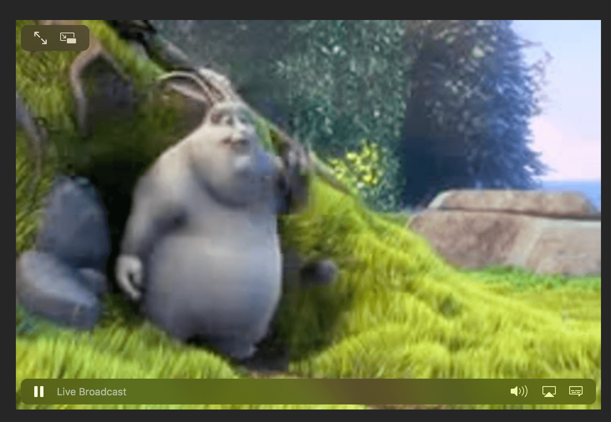

## Live Stream : Fundamentals

### Requirements
 * [FFMPEG with h264 codec](install-ffmpeg.sh)
 
 
### Server (To be hosted on AWS)
Has two components
 * [Encoder](server/encode.sh): Listens on port 5050 for video stream, and encodes it to **live** folder using HLS encoding, with adaptive bit rate. (Creates video chunk **.ts files** of 1 second each.)
 * [CDN Simulator](server/simulate-cdn.sh): Hosts the **live** folder on port 8080. Ideally the files inside the **live** folder needs to be uploaded to S3, which will be frontended by a CDN like *CloudFront* or *Akamai*. (The **.m3u8** files are re-generated every second, hence the CDN must be configured, not to cache them).
 
### Camera
 * [Publisher](camera/publish.sh): Run it from a laptop which has direct access to the camera. It publishes the video stream  to the server(Encoder), on port 5050
 
### How to Run
1. `cd server`
2. `./encode.sh`
3. `./simulate-cdn.sh`
4. `cd ../camera`
5. `./publish.sh`

(Sequencing matters)

### Hardware Accelerating FFmpeg
FFmpeg encoding on CPU slows down, as the number of parallel streams for adaptive bit rate increases. Hardware acceleration is required to achieve near real-time performance. 

1. Spin off an [AWS G3 Nvidia GPU Instance](https://aws.amazon.com/ec2/instance-types/g3/) (These are very costly instances, so run them only when the live stream is on)
2. [Install Nvidia drivers](https://docs.aws.amazon.com/AWSEC2/latest/UserGuide/install-nvidia-driver.html)
3. [Install CUDA 9.1](https://developer.nvidia.com/cuda-downloads)
4. [Compile FFmpeg with CUDA](https://developer.nvidia.com/ffmpeg)

### Demo

[Demo Link](https://s3-ap-southeast-1.amazonaws.com/com.inmobi.oem.ap-southeast-1.dev/test/abcd/playlist.m3u8)

*Safari on Mac & iOS shows a "Live Broadcast" indicator in the player*
